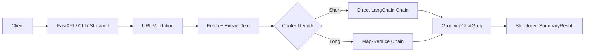

# URL Summarizer

Production-ready AI URL summarizer powered by **LangChain** and **Groq**.

Paste a public URL → fetch page text → summarize with a LangChain LCEL pipeline (direct or map-reduce) → structured JSON output.

## Features

- **LangChain LCEL chains** with map-reduce for long pages
- **Structured output** (`title` + bullet points) via Pydantic
- **FastAPI REST API** with health checks and optional API key auth
- **Streamlit UI** and **CLI** for local use
- **SSRF-safe URL validation**, fetch retries, and configurable limits
- **Docker** support for deployment

## Architecture



## Setup

```bash
python -m venv .venv
source .venv/bin/activate
pip install -e ".[dev]"
cp .env.example .env
# Put your Groq API key in .env as GROQ_API_KEY=...
```

## Run

### REST API

```bash
uvicorn url_summarizer.api.app:app --reload --port 8000
```

```bash
curl -X POST http://localhost:8000/api/v1/summarize \
  -H "Content-Type: application/json" \
  -d '{"url": "https://example.com"}'
```

### Streamlit UI

```bash
streamlit run app.py
```

### CLI

```bash
python main.py https://example.com
python main.py https://example.com --json
```

## Configuration

| Variable | Default | Description |
|---|---|---|
| `GROQ_API_KEY` | _(required)_ | Groq API key |
| `GROQ_MODEL` | `openai/gpt-oss-20b` | Groq model name |
| `FETCH_TIMEOUT_SECONDS` | `15` | HTTP fetch timeout |
| `MAX_CONTENT_CHARS` | `50000` | Max extracted text length |
| `MAP_REDUCE_THRESHOLD` | `6000` | Use map-reduce above this char count |
| `API_KEY` | _(unset)_ | If set, requires `X-API-Key` header |
| `LOG_LEVEL` | `INFO` | Logging level |

## Deploy (share a public link)

### Why not GitHub Pages / Firebase Hosting / Vercel?

Those hosts are for **static websites** (HTML/CSS/JS).

This UI is **Streamlit** — a live Python app that:
- fetches URLs
- calls Groq via LangChain

It needs a **Python server**, so static hosting cannot run it.

### Free option that works: Streamlit Community Cloud

1. Go to [share.streamlit.io](https://share.streamlit.io)
2. Sign in with GitHub
3. Deploy repo `rohail111/url-summarizer`
4. Main file: `app.py`
5. Add secrets (App settings → Secrets):

```toml
GROQ_API_KEY = "gsk_your_real_key"
GROQ_MODEL = "openai/gpt-oss-20b"
```

6. Share the generated `*.streamlit.app` URL with colleagues

### Docker / API hosts

```bash
export GROQ_API_KEY=gsk_your_key_here
docker compose up --build
```

For the FastAPI API on Render/Railway, set `GROQ_API_KEY` and start with:

`uvicorn url_summarizer.api.app:app --host 0.0.0.0 --port $PORT`

Free API tiers usually sleep when idle (not truly 24/7).

## Tests

```bash
pytest
```
